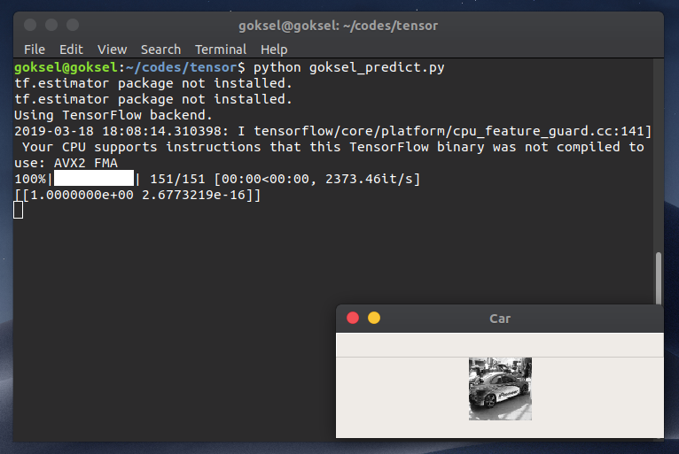
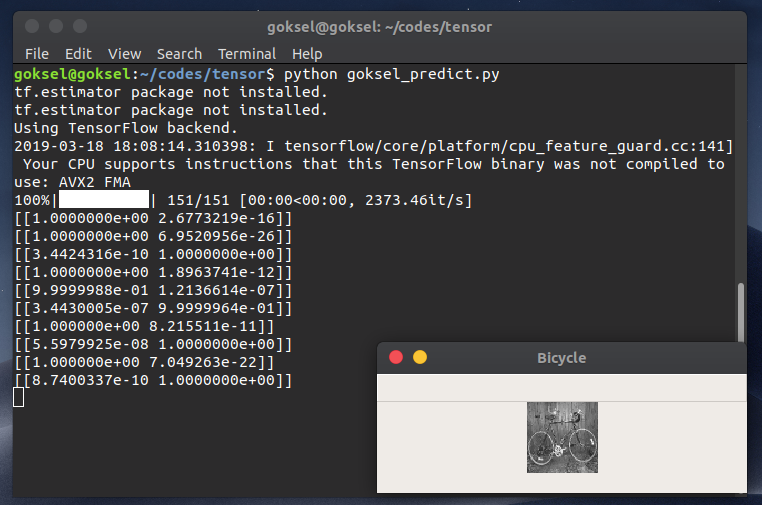
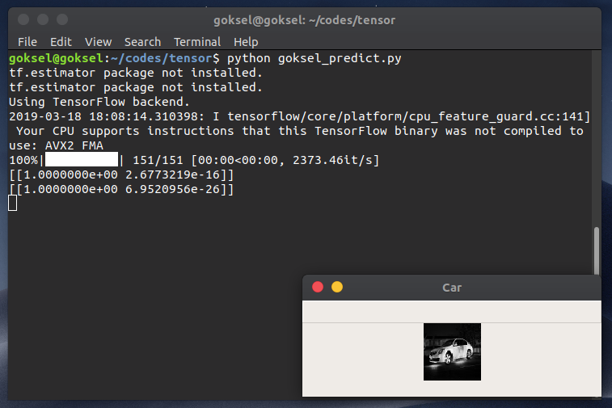

# imageclassifier

USAGE:
`goksel_train.py` can be used for training. Your all training images should be `car.1.jpeg` format.

`goksel_predict.py` can be used for classifying.

Additionally, you can change number of class with small changings in:
    1. `class_names = ['car', 'bicycle']`
    2. `label function`
    3. `predictimg function`

Example Outputs:

