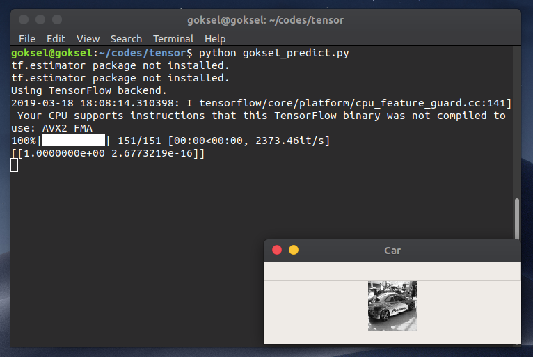
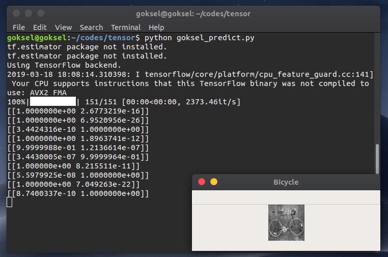
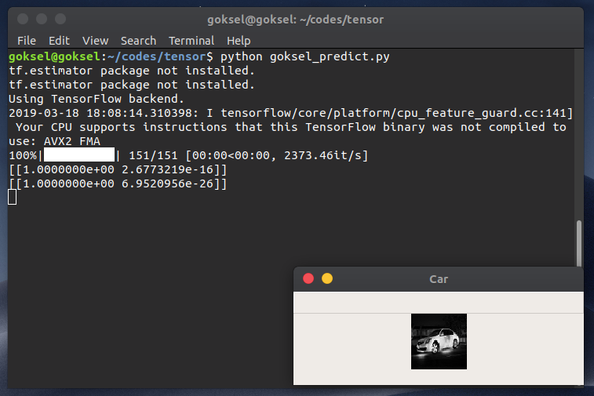
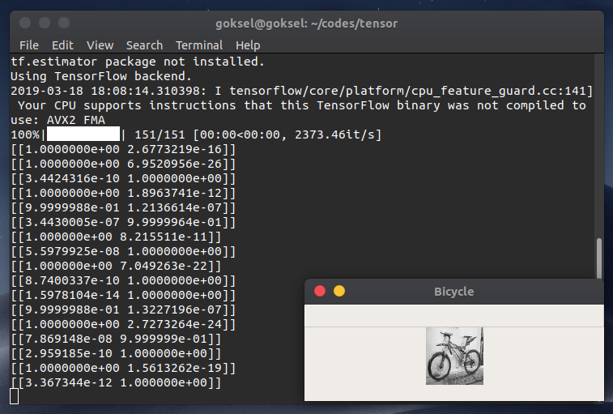

# imageclassifier

USAGE:
`goksel_train.py` can be used for training. Your all training images should be `car.1.jpeg` format.

`goksel_predict.py` can be used for classifying.

Example Outputs:

